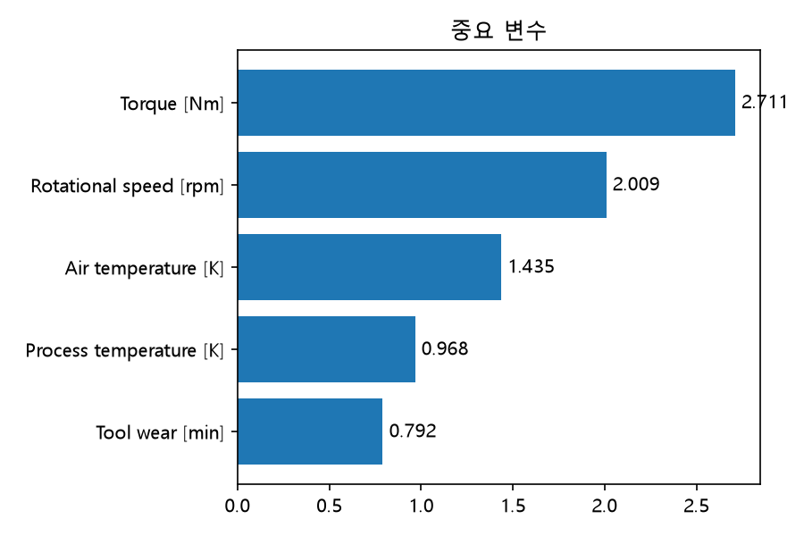
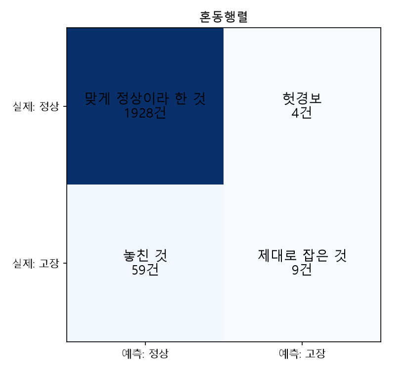
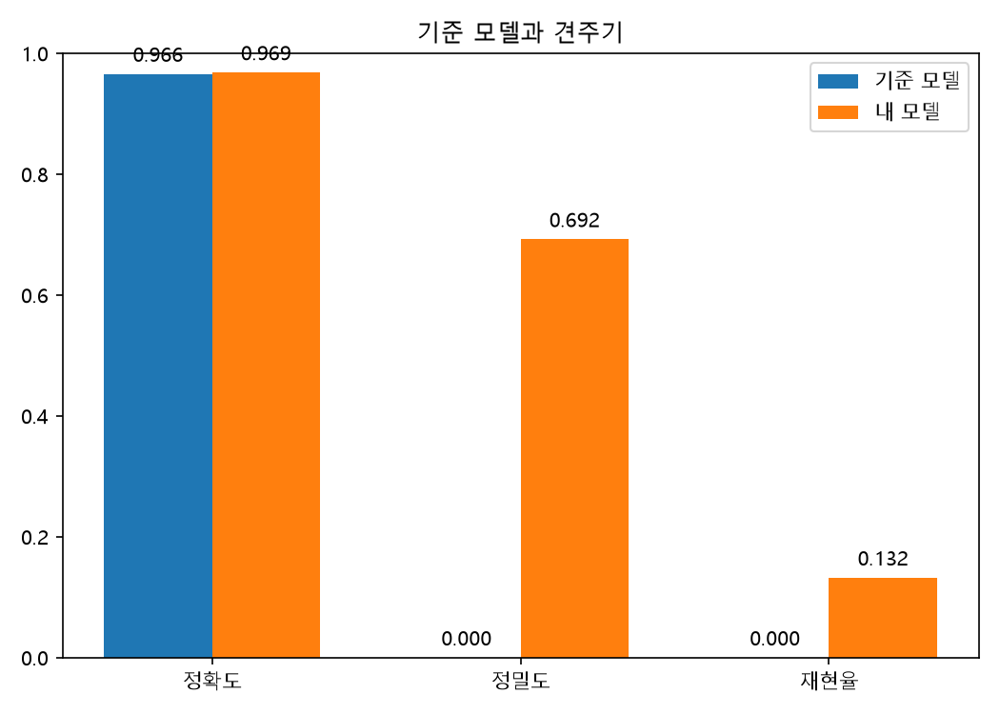

# 설비 측정값으로 고장을 미리 알아채기 (day12/project_v2)

공정 조건 다섯 가지(외기온도·공정온도·회전속도·토크·공구마모)로, 설비가 고장인지 아닌지를 판별합니다.

## 왜 이 문제인가

고장을 놓치면 라인이 멈춥니다. 멈춘 뒤에 아는 것과 미리 아는 것은 비용이 다릅니다.

## 데이터

- 공개 데이터 / 10,000행 x 7열 / 결과 열은 정상·고장 / 고장 339건 (3.39%)
- 데이터 출처 : 강사 선생님 제공

## 무엇을 했나

숫자 열만 골라 입력으로 씀 / 빈칸은 중앙값으로 / 학습용과 시험용을 8대 2로 나눔 / 표준화 후 로지스틱 회귀로 학습, 전부 정상이라 답하는 기준 모델과 견줌

## 결과 수치

전부 정상이라 답하는 기준 모델 96.60% 대비 96.85%. 지목한 13건 중 9건이 진짜 고장이었으나, 실제 68건 중 59건은 놓쳤다. 정확도만 보면 차이가 없어 보여 재현율을 함께 봤다.

## 결과 그림

## 그래서 무엇을 하자는 것인가

놓친 고장이 헛경보보다 비싼 현장이라면, 문턱을 낮춰 지목을 늘리는 편이 나을 수 있습니다.

## 한계와 다음

한 기간의 공개 데이터라 다른 라인에 그대로 적용된다고 보기는 어렵습니다. 어느 항목이 원인이라고 말할 수는 없습니다. 다음에는 기간을 나눠 검증해볼 예정입니다.

---

작성일 : 2026-08-24

---

## 확인한 것

- **인과 단정 표현 확인**: 카드 여덟 칸 안에서 "~때문에", "~가 원인이다"처럼 단정하는 문장은 찾지 못해서 고칠 게 없었습니다(8번 칸은 오히려 "원인이라고 말할 수는 없다"고 이미 스스로 선을 그어뒀습니다).
